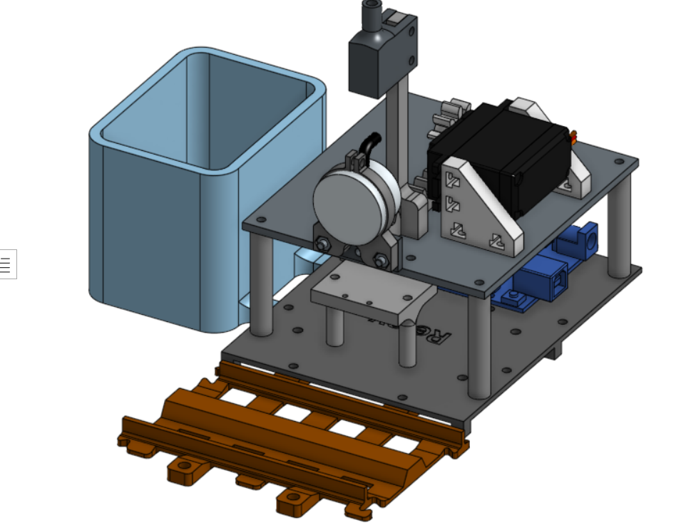
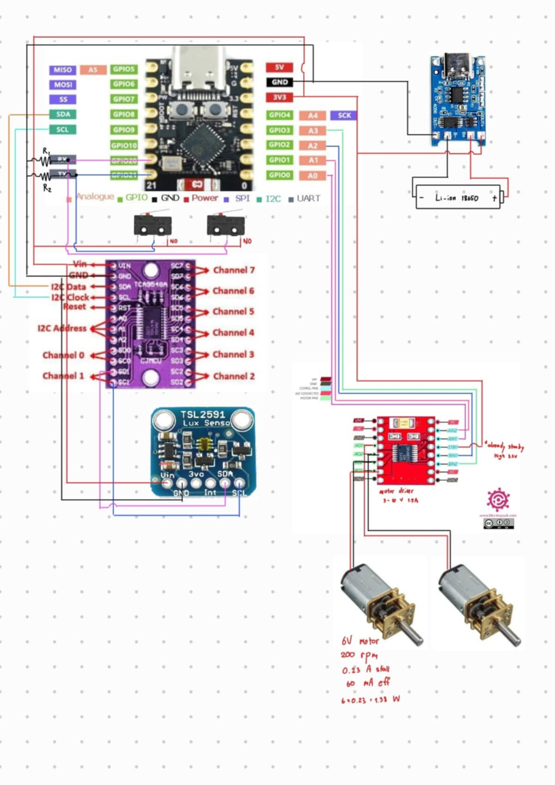

# Planet-Centric-Project-Plant-train
โปรเจคนี้เป็นของวิชา FRA503 : PLANET-CENTRIC ROBOTICS &amp; INNOVATION

# แนวคิดและที่มา
การปลูกต้นไม้บนโต๊ะทำงานไม่เพียงช่วยสร้างบรรยากาศที่ร่มรื่นและน่าอยู่เท่านั้น แต่ยังมีส่วนช่วยฟอกอากาศและส่งเสริมสุขภาพจิตของผู้ปฏิบัติงานอีกด้วย หลายงานวิจัยชี้ว่าการมีต้นไม้ในพื้นที่ทำงานสามารถลดความเครียด เพิ่มสมาธิ และสร้างความรู้สึกผ่อนคลาย ส่งผลให้เกิดประสิทธิภาพในการทำงานที่ดีขึ้น ดังนั้นแนวคิดการปลูกต้นไม้บนโต๊ะทำงานจึงเป็นจุดเริ่มต้นของโครงการนี้

ในปัจจุบันมีนวัตกรรมต้นไม้แบบอัจฉริยะ เช่น Smart Plant Ivy ซึ่งรวมเซนเซอร์วัดค่าความชื้น แสง และระบบควบคุมต่างๆ ไว้ในกระถางต้นไม้เดียว อย่างไรก็ตาม หากต้องการปลูกหลายต้น ก็จำเป็นต้องมีเซนเซอร์และอุปกรณ์แยกในแต่ละกระถาง ซึ่งทำให้ต้นทุนสูงขึ้นอย่างไม่จำเป็น

เพื่อแก้ปัญหาดังกล่าว ผู้จัดทำจึงเสนอแนวคิดการรวมระบบเซนเซอร์ไว้ในจุดเดียว และออกแบบให้แต่ละกระถางสามารถใช้เซนเซอร์ร่วมกันได้ เพื่อลดค่าใช้จ่ายและความซับซ้อนของระบบ

อีกหนึ่งปัญหาที่พบในการปลูกต้นไม้บนโต๊ะทำงานคือ “ตำแหน่งการวางกระถาง” หากวางไว้ในบริเวณที่แสงไม่เพียงพอ ต้นไม้อาจไม่เจริญเติบโตหรือตายได้

จากปัญหาและแนวคิดข้างต้น จึงได้ออกแบบนวัตกรรม "กระถางต้นไม้เคลื่อนที่ได้" ซึ่งสามารถเคลื่อนย้ายตัวเองเพื่อหาตำแหน่งที่มีแสงเหมาะสม และสามารถวัดค่าต่างๆ ผ่านเซนเซอร์ส่วนกลางร่วมกันได้ ช่วยเพิ่มโอกาสในการเจริญเติบโตของพืช และยังลดต้นทุนในการติดตั้งระบบเซนเซอร์อีกด้วย

## Plant train

## Water station

## Overview wiring diagram

## Electronics Component

**"On Plant train"**

- **Microcontroller:** ESP32 C3 mini

- **Motor Driver:** DRV8833

- **Lux sensor:** BH1750 (วัดความเข้มของแสง) *ในรูปประกอบไม่ถูกต้อง

- **Color sensor:** TCS34725 (สำหรับอ่านแถบสีคำสั่ง)

- **I2C Multiplexer:** TCA9548A (สำหรับขยายช่องสัญญาณ I2C)

- **Lithium Charging module:** USB TYPE-C charger TP4056 1A (สำหรับชาร์จแบตเตอรี่ลิเธียม 18650)

- **Micro switch**

- **Resistor:** 10K (สำหรับต่อ microswitch เพราะ ESP32 C3 ไม่มี Internal Pullup ในตัว)
- 
**"On Water station"**

- **Microcontroller:** Arduino Uno

- **Water level non contack sensor:** XKCY25 (วัดระดับน้ำแบบไร้สัมผัส)

- **Hall effect magnetic sensor:** KY-035 (สำหรับตรวจเช็คการมาของรถไฟ)

- **Relay module:** 4 channel-Relay

