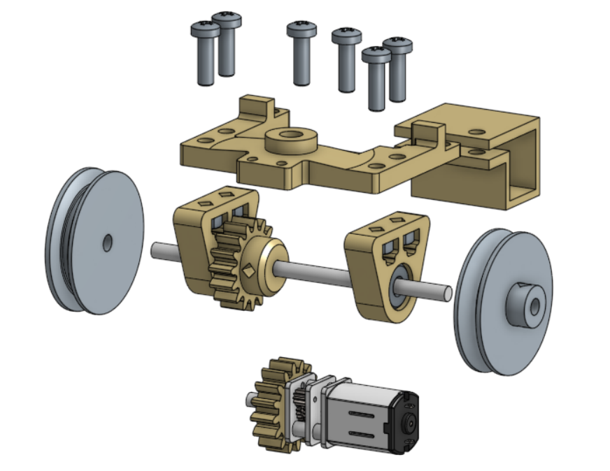
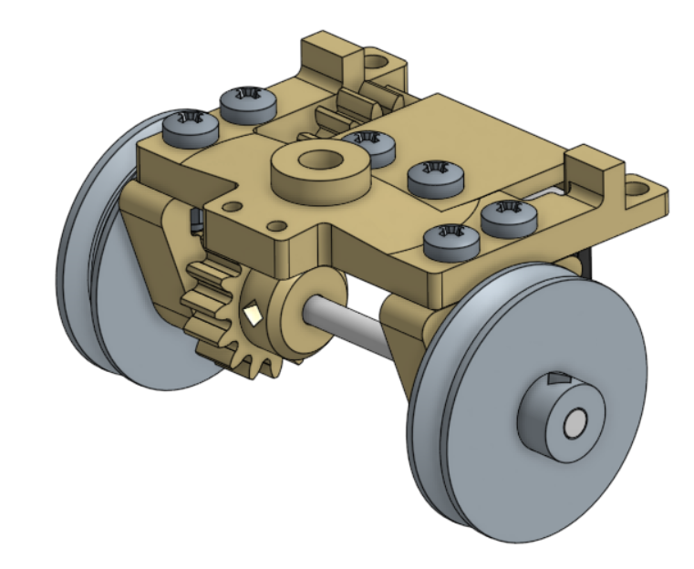
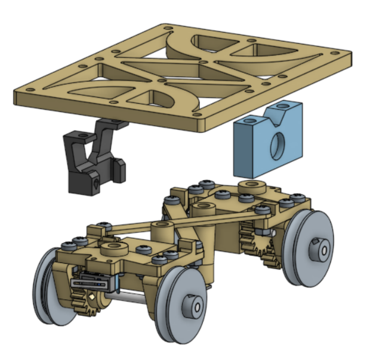
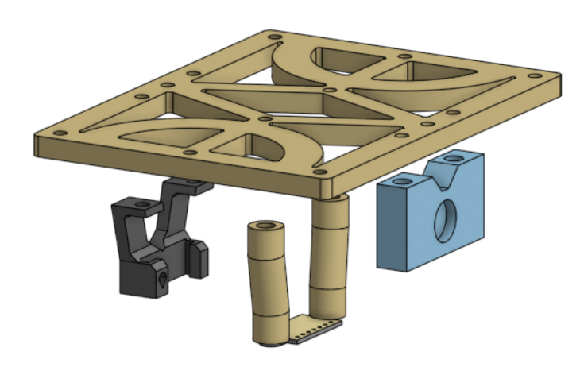
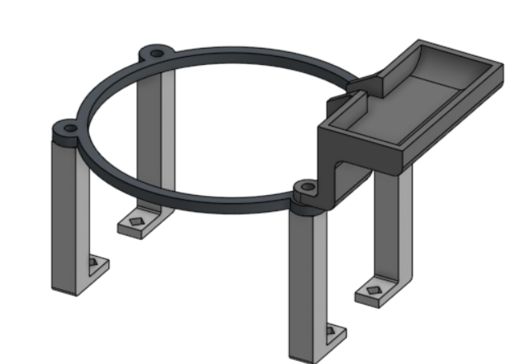
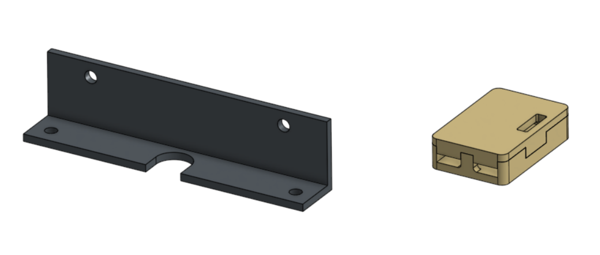
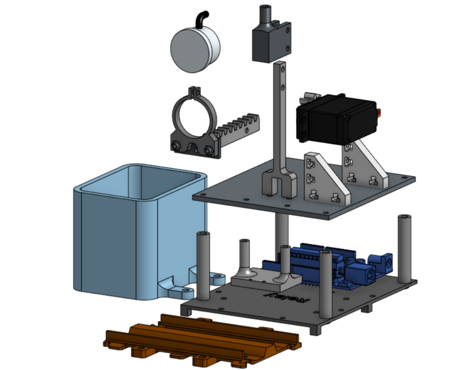

# Planet-Centric-Project-Plant-train
โปรเจคนี้เป็นของวิชา FRA503 : PLANET-CENTRIC ROBOTICS &amp; INNOVATION

ผูัจัดทำ : อาคม สนธิขันธ์

# แนวคิดและที่มา
การปลูกต้นไม้บนโต๊ะทำงานไม่เพียงช่วยสร้างบรรยากาศที่ร่มรื่นและน่าอยู่เท่านั้น แต่ยังมีส่วนช่วยฟอกอากาศและส่งเสริมสุขภาพจิตของผู้ปฏิบัติงานอีกด้วย หลายงานวิจัยชี้ว่าการมีต้นไม้ในพื้นที่ทำงานสามารถลดความเครียด เพิ่มสมาธิ และสร้างความรู้สึกผ่อนคลาย ส่งผลให้เกิดประสิทธิภาพในการทำงานที่ดีขึ้น ดังนั้นแนวคิดการปลูกต้นไม้บนโต๊ะทำงานจึงเป็นจุดเริ่มต้นของโครงการนี้

ในปัจจุบันมีนวัตกรรมต้นไม้แบบอัจฉริยะ เช่น Smart Plant Ivy ซึ่งรวมเซนเซอร์วัดค่าความชื้น แสง และระบบควบคุมต่างๆ ไว้ในกระถางต้นไม้เดียว อย่างไรก็ตาม หากต้องการปลูกหลายต้น ก็จำเป็นต้องมีเซนเซอร์และอุปกรณ์แยกในแต่ละกระถาง ซึ่งทำให้ต้นทุนสูงขึ้นอย่างไม่จำเป็น

เพื่อแก้ปัญหาดังกล่าว ผู้จัดทำจึงเสนอแนวคิดการรวมระบบเซนเซอร์ไว้ในจุดเดียว และออกแบบให้แต่ละกระถางสามารถใช้เซนเซอร์ร่วมกันได้ เพื่อลดค่าใช้จ่ายและความซับซ้อนของระบบ

อีกหนึ่งปัญหาที่พบในการปลูกต้นไม้บนโต๊ะทำงานคือ “ตำแหน่งการวางกระถาง” หากวางไว้ในบริเวณที่แสงไม่เพียงพอ ต้นไม้อาจไม่เจริญเติบโตหรือตายได้

จากปัญหาและแนวคิดข้างต้น จึงได้ออกแบบนวัตกรรม "กระถางต้นไม้เคลื่อนที่ได้" ซึ่งสามารถเคลื่อนย้ายตัวเองเพื่อหาตำแหน่งที่มีแสงเหมาะสม และสามารถวัดค่าต่างๆ ผ่านเซนเซอร์ส่วนกลางร่วมกันได้ ช่วยเพิ่มโอกาสในการเจริญเติบโตของพืช และยังลดต้นทุนในการติดตั้งระบบเซนเซอร์อีกด้วย

## Plant train


## Water station


## Overview wiring diagram


## Electronics Component

**"On Plant train"**


- **Microcontroller:** ESP32 C3 mini

- **Motor Driver:** DRV8833

- **Lux sensor:** BH1750 (วัดความเข้มของแสง)

- **Color sensor:** TCS34725 (สำหรับอ่านแถบสีคำสั่ง)

- **I2C Multiplexer:** TCA9548A (สำหรับขยายช่องสัญญาณ I2C)

- **Lithium Charging module:** USB TYPE-C charger TP4056 1A (สำหรับชาร์จแบตเตอรี่ลิเธียม 18650)

- **ฺBattery:** 186500 Lithium Battery

**"On Water station"**

- **Microcontroller:** Arduino Uno

- **Water level non contack sensor:** XKCY25 (วัดระดับน้ำแบบไร้สัมผัส)

- **Hall effect magnetic sensor:** KY-035 (สำหรับตรวจเช็คการมาของรถไฟ)

- **Relay module:** 4 channel-Relay

- **DC Water pump**

- **Servo motor:** MG995 180 degree servo motor

## Mechanics Part

- **3D Print part**

- **Shaft diameter:** 3 mm

- **Bearing:** 603ZZ

- **O-ring:** ID 19 mm 2 mm thickness

- **Heat brass insert**

- **Bolt&Nuts :** ส่วนใหญ่เป็นขนาด M3 ยาว 6-12 mm ขึ้นอยู่กับส่วนไหนใส่ได้ยาวแค่ไหน

## อุปกรณ์ที่เหลือ

- กระถางรดน้ำเอง แบบใช้หลักการกาลักน้ำ
- สายยางซิลิโคน ID 7 mm

## ภาพ CAD การประกอบคร่าวๆ และส่วนประกอบ



- ใช้ shaft ประมาณ 65mm
- ใช้ set screw M3 กับล้อและเฟือง
- ประกอบส่วนล้อก่อนแล้วประกอบชุดมอเตอร์ทีหลัง
- ใส่เฟืองกับมอเตอร์ก่อนประกอบเข้าด้วยกัน
- ใช้ Screw M3*10 และ nut เป็นส่วนใหญ่





- ประกอบ wheel set กับ base ด้วยสกรู M3*10 mm มันจะยึดไม่แน่นเพื่อให้รถสามารถเลี้ยวได้ สามารถเพิ่มเติมด้วยการใส่ น้ำยาล็อกเกลียวเพิ่ม เพื่อให้สกรูไม่คลาย หรือออกแบบใหม่ให้ดีขึ้น



- spacer ยึด color sensor ทั้งสองด้านมี heat brass insert อยู่
- ประกับเซนเซอร์ก่อนค่อยประกอบกับ base
- ตัวยึด motor drive แนะนำให้ใส่ก่อนโดยการเลื่อนเข้าไปแล้วขันล็อกด้วย set screw M3 ก่อนแล้วบัดกรีสายไฟเข้าไป
- ตัวยึดแม่เหล็ก ก่อนใส่เช็คด้านของแม่เหล็กก่อน เพราะเอาออกยาก





- ใช้กับรังถ่านแบตเตอรี่ลิเธียม 18650 แบบไม่มีสปริงขดลวด
- ใช้ Screw Tapor M3 แล้วล็อกด้วย nut
- บัดกรีสายไฟกับชุดชาร์จก่อนประกอบกับ case แล้วติดด้วยกาวสองหน้า

**ข้อสังเกตและการแนะนำ**
- รูขนาดประมาณ 4.5 mm สำหรับใส่ heat brass insert
- เริ่มประกอบจาก wheel set ก่อน ประกอบที่ล็อกมอเตอร์ และปิดป้ายด้วย X beam เชื่อม Wheel set 2 ชุดเข้าด้วยกัน


- ประกอบกับรางตรงเฉพาะแบบในรูปเท่านั้น
- ติดตั้ง relay และ arduino uno ก่อน ตามด้วยประกอบชั้นสองตาม
- ประกอบ servo โดยเซ็ตตำแหน่ง 0 องศาก่อน แล้วเลื่อน rack gear เข้าไป จุดท้ายประกอบ pinion gear ตามเข้าไป
  *จำเป็นออกแบบตัวติดตั้ง Hall effect magnetic sensor ใหม่



## Code สำหรับตัวรถ

ก่อน upload เช็คหัวข้อ USB CDC On Boot หากใช้โปรแกรม Arduino IDE

```bash
#include <Wire.h>
#include <Adafruit_Sensor.h>
#include <Adafruit_TSL2591.h>
#include "TCA9548A.h"  //I2C multiplexer module
#include "Adafruit_TCS34725.h"
#include <BH1750.h>  //lux sensor module

#define commonAnode true
#define pwmA 0
#define in1A 1
#define in2A 2
#define pwmB 3
#define in1B 5
#define in2B 4
#define frontLimit 20
#define backLimit 21

TCA9548A mux;  //call multiplexer as mux

int LuxsensorState = 0;
unsigned long LuxlastReadTime = 0;
const unsigned long LuxsensorDelay = 5;

int ColorsensorState = 0;
unsigned long ColorlastReadTime = 0;
const unsigned long ColorsensorDelay = 5;

int countSun, countWater = 0;
bool trickDone = false;
float red, green, blue;
int WhiteTableOnRail_config[3] = {83,98,68};
int WhiteCode[3] = {70,101,75};
int RedCode[3] = {120,75,62};
int timeout = 30000;
float LeftFront, LeftBack, RightFront, RightBack; //for luxData

// Look from top view
//       front(B)
//      0 ------ 3
//          ||
//   left   ||   right
//          ||
//      1 ------ 2
//        back(A)
BH1750 lightMeter0(0x23);
BH1750 lightMeter1(0x23);
BH1750 lightMeter2(0x23);
BH1750 lightMeter3(0x23);

//color sensor config
Adafruit_TCS34725 tcs = Adafruit_TCS34725(TCS34725_INTEGRATIONTIME_50MS, TCS34725_GAIN_4X);


Adafruit_TSL2591 tsl = Adafruit_TSL2591(2591);


void lux_read(float* LeftFront, float* LeftBack, float* RightFront, float* RightBack);      // ประกาศฟังก์ชันที่อยู่ในไฟล์อื่น
void engine_start();  // ถ้าเรียกใช้ก็ประกาศไว้ด้วย


/* TCA9548A multi sent 0x29 for communicate TSL2591 so need to command to tca to tell tsl*/
void setup() {
  delay(1000);
  Serial.begin(115200);
  pinMode(pwmA, OUTPUT);
  pinMode(pwmB, OUTPUT);
  pinMode(in1A, OUTPUT);
  pinMode(in2A, OUTPUT);
  pinMode(in1B, OUTPUT);
  pinMode(in2B, OUTPUT);
  pinMode(frontLimit, INPUT);
  pinMode(backLimit, INPUT);
  Wire.begin(8, 9);  // GPIO 8 = SDA, GPIO 9 = SCL
  mux.begin(Wire);   // Use Wire instance
  mux.closeAll();    // Optional: reset all channels

  Serial.println(F("Starting"));

  //check lux sensor's read

  mux.openChannel(0);
  if (lightMeter0.begin(BH1750::CONTINUOUS_HIGH_RES_MODE)) {
    Serial.println(F("Left_Front sensor checked!"));
  } else {
    Serial.println(F("Left_Front sensor error!"));
  }
  delay(150);

  mux.openChannel(1);
  if (lightMeter1.begin(BH1750::CONTINUOUS_HIGH_RES_MODE)) {
    Serial.println(F("Left_Back sensor checked!"));
  } else {
    Serial.println(F("Left_Back sensor error!"));
  }
  delay(150);

  mux.openChannel(2);
  if (lightMeter2.begin(BH1750::CONTINUOUS_HIGH_RES_MODE)) {
    Serial.println(F("Right_Back sensor checked!"));
  } else {
    Serial.println(F("Right_Back sensor error!"));
  }
  delay(150);

  mux.openChannel(3);
  if (lightMeter3.begin(BH1750::CONTINUOUS_HIGH_RES_MODE)) {
    Serial.println(F("Right_Front sensor checked!"));
  } else {
    Serial.println(F("Right_Front sensor error!"));
  }
  delay(150);

  //check color sensor's status
  mux.openChannel(7);
  if (tcs.begin()) {
    Serial.println(F("TCS34725 COLOUR checked!"));
  } else {
    Serial.println(F("TCS34725 COLOUR not found!"));
  }
  delay(150);
  goWaterStation();
}

void loop() {
  int start_time = millis();
  while(millis() - start_time < 10000){
    followLight();
  }
  goWaterStation();
  delay(2000);

  // color_read();
}

/*funtion check water*/
void water_level() {
  /*506 mai jer
4095 jer*/
  if (analogRead(A0) >= 2300) {
    Serial.println("Water detected");
  } else {
    Serial.println("No Water");
  }
  delay(1000);
  // Serial.println(analogRead(A0));
}

/*function colour code*/
void track() {
  while (1) {
    if (digitalRead(frontLimit) == 1 && digitalRead(backLimit) == 1) {
      goFront(255, 255);
    } else if (digitalRead(frontLimit) == 0 && digitalRead(backLimit) == 1) {
      goBack(255, 255);
    } else if (digitalRead(frontLimit) == 0 && digitalRead(backLimit) == 0) {
      break;
    }
  }
}

void checkLimit() {  //limit switch active low
  if (digitalRead(frontLimit) == 0 && digitalRead(backLimit) == 1) {
    Serial.println("Front Limit Trigger");
  } else if (digitalRead(frontLimit) == 1 && digitalRead(backLimit) == 0) {
    Serial.println("Back Limit Trigger");
  } else if (digitalRead(frontLimit) == 0 && digitalRead(backLimit) == 0) {
    Serial.println("Both Limit Trigger");
  }
}


/* new code after test on I2C*/
void configureSensor(void) {
  tsl.setGain(TSL2591_GAIN_MED);
  tsl.setTiming(TSL2591_INTEGRATIONTIME_300MS);

  Serial.println(F("Sensor configured."));
}

void goFront(int MotorSpeed1, int MotorSpeed2) {
  int MotorStartSpeed1 = round((MotorSpeed1) / 3);
  int MotorStartSpeed2 = round((MotorSpeed2) / 3);
  digitalWrite(in1A, LOW);
  digitalWrite(in2A, HIGH);
  analogWrite(pwmA, MotorStartSpeed1);
  delay(50);
  digitalWrite(in1B, LOW);
  digitalWrite(in2B, HIGH);
  analogWrite(pwmB, MotorStartSpeed2);
  delay(100);
  analogWrite(pwmA, MotorSpeed1);
  delay(10);
  analogWrite(pwmB, MotorSpeed2);
}

void goBack(int MotorSpeed1, int MotorSpeed2) {
  int MotorStartSpeed1 = round((MotorSpeed1) / 3);
  int MotorStartSpeed2 = round((MotorSpeed2) / 3);
  digitalWrite(in1A, HIGH);
  digitalWrite(in2A, LOW);
  analogWrite(pwmA, MotorStartSpeed1);
  delay(50);
  digitalWrite(in1B, HIGH);
  digitalWrite(in2B, LOW);
  analogWrite(pwmB, MotorStartSpeed2);
  delay(100);
  analogWrite(pwmA, MotorSpeed1);
  delay(10);
  analogWrite(pwmB, MotorSpeed2);
}

void stop() {  // a is time in millisecond
  digitalWrite(in1A, LOW);
  digitalWrite(in2A, LOW);
  digitalWrite(in1B, LOW);
  digitalWrite(in2B, LOW);
}

void engine_start() {

  bool flag = false;
  Serial.println(digitalRead(frontLimit));
  Serial.println(digitalRead(backLimit));

  while (1) {
    if (digitalRead(frontLimit) == 0 && digitalRead(backLimit) == 0) {  //active low
      Serial.println("Ready");
      flag = true;
      break;
    } else
      Serial.println("Please hold 2 button to start!");
    delay(100);
  }
}

void color_read() {
  static int color_read[3];
  static int color_treshold = 5;

  mux.writeRegister(TCA_CHANNEL_7);
  delay(10);
  tcs.getRGB(&red, &green, &blue);
  color_read[0] = red;
  color_read[1] = green;
  color_read[2] = blue;
  delay(5);
  Serial.print("R:\t");
  Serial.print(int(red));
  Serial.print("\tG:\t");
  Serial.print(int(green));
  Serial.print("\tB:\t");
  Serial.print(int(blue));
  Serial.print("\n");
  if (abs(color_read[0] - WhiteCode[0]) < color_treshold && abs(color_read[1] - WhiteCode[1]) < color_treshold && abs(color_read[2] - WhiteCode[2]) < color_treshold) {
    Serial.print("White");
  }
  if (abs(color_read[0] - RedCode[0]) < color_treshold && abs(color_read[1] - RedCode[1]) < color_treshold && abs(color_read[2] - RedCode[2]) < color_treshold) {
    Serial.print("Red");
  }
  else {
    Serial.print("none");
  }
}


void goWaterStation() {
  int color_treshold = 5;
  unsigned long start_time = 0;  //time
  goFront(160,160);
  while (1) {
    color_read();
    int color_read[3] = { int(red), int(green), int(blue) };
    if (abs(color_read[0] - WhiteCode[0]) < color_treshold && abs(color_read[1] - WhiteCode[1]) < color_treshold && abs(color_read[2] - WhiteCode[2]) < color_treshold) {
      Serial.print("It's White");
      Serial.print("\n");
      goFront(60,60);
    }
    else if (abs(color_read[0] - RedCode[0]) < color_treshold && abs(color_read[1] - RedCode[1]) < color_treshold && abs(color_read[2] - RedCode[2]) < color_treshold) {
      Serial.print("It's Red");
      Serial.print("\n");
      stop();
      delay(15000);
      break;
    }
    if (millis() - start_time > timeout) {
      Serial.println("Time out! Cancel action");
      stop();
      break;
    }
  }
  goFront(100,100);
  delay(2000);
  stop();
}

void lux_read(float* LeftFront, float* LeftBack, float* RightFront, float* RightBack) {
  float lux0, lux1, lux2, lux3, cf_med;

  cf_med = 0.00062594;

  // Read from sensor 0 (channel 0)
  mux.openChannel(0);
  delay(10);  // Wait for measurement time
  if (lightMeter0.measurementReady()) {
    *LeftFront = lightMeter0.readLightLevel() * cf_med;
  }
  mux.closeAll();

  // Read from sensor 1 (channel 1)
  mux.openChannel(1);
  delay(10);  // Wait for measurement time
  if (lightMeter1.measurementReady()) {
    *LeftBack = lightMeter1.readLightLevel() * cf_med;
  }
  mux.closeAll();

  // Read from sensor 2 (channel 2)
  mux.openChannel(2);
  delay(10);  // Wait for measurement time
  if (lightMeter2.measurementReady()) {
    *RightBack = lightMeter2.readLightLevel() * cf_med;
  }
  mux.closeAll();

  // Read from sensor 3 (channel 3)
  mux.openChannel(3);
  delay(10);  // Wait for measurement time
  if (lightMeter3.measurementReady()) {
    *RightFront = lightMeter3.readLightLevel() * cf_med;
  }
  mux.closeAll();

  /*/         front
          0 ------ 3
              ||
       left   ||   right
              ||
          1 ------ 2
             back       /*/

  delay(10);  // Wait before next loop
}

void followLight() {
  // unsigned long start_time = 0;  //time
  // bool flag = true;
  // int threshold = 5;
  // int max_sum = 0;
  // int sum = 0;
  // int cf_med = 0.00062594;
  // while (flag) {
  //   lux_read(&LeftFront, &LeftBack, &RightFront, &RightBack);
  //   LeftFront = (LeftFront*1600);
  //   RightFront = (RightFront*1600);
  //   LeftBack = (LeftBack*1600);
  //   RightBack = (RightBack*1600);
  //   Serial.println(LeftFront);
  //   Serial.println(RightFront);
  //   Serial.println(LeftBack);
  //   Serial.println(RightBack);
  //   Serial.println("\n");
  //   int sum = LeftBack + RightBack + LeftFront + RightFront;
  //   // int max_lightSource_dir = max(max(LeftFront,LeftBack),max(RightFront,RightBack)));

  //   if ((LeftFront + RightFront) - (LeftBack + RightBack) > threshold ) {
  //     goFront(255, 255);
  //     if ((LeftFront + RightFront) - (LeftBack + RightBack) < threshold ){
  //       goFront(50,50);
  //     }
  //     else {
  //       stop();
  //     }
  //   }
  //   else if ((LeftBack + RightBack) - (LeftFront + RightFront) > threshold ){
  //     goBack(255,255);
  //     if ((LeftFront + RightFront) - (LeftBack + RightBack) < threshold ){
  //       goBack(50,50);
  //     }
  //     else {
  //       stop();
  //     }
  //   }
  //   if (sum > max_sum){
  //     int max_sum = sum;
  //   }
  //   // if (millis() - start_time > timeout) {
  //   //   Serial.println("Time out! Cancel action");
  //   //   stop();
  //   //   break;
  //   // }

  // }
  static float LeftFront, LeftBack, RightFront, RightBack;
  static unsigned long max_sum = 0;
  static unsigned long start_time = millis();
  static unsigned long timeout = 10000;

  switch (LuxsensorState) {
    case 0:  // READ_LF
      mux.openChannel(0);
      LuxlastReadTime = millis();
      LuxsensorState = 1;
      break;

    case 1:  // WAIT_LF
      if (millis() - LuxlastReadTime >= LuxsensorDelay) {
        if (lightMeter0.measurementReady()) {
          LeftFront = lightMeter0.readLightLevel() * 0.00062594 * 1600;
        }
        mux.closeAll();
        LuxsensorState = 2;
      }
      break;

    case 2:  // READ_LB
      mux.openChannel(1);
      LuxlastReadTime = millis();
      LuxsensorState = 3;
      break;

    case 3:  // WAIT_LB
      if (millis() - LuxlastReadTime >= LuxsensorDelay) {
        if (lightMeter1.measurementReady()) {
          LeftBack = lightMeter1.readLightLevel() * 0.00062594 * 1600;
        }
        mux.closeAll();
        LuxsensorState = 4;
      }
      break;

    case 4:  // READ_RB
      mux.openChannel(2);
      LuxlastReadTime = millis();
      LuxsensorState = 5;
      break;

    case 5:  // WAIT_RB
      if (millis() - LuxlastReadTime >= LuxsensorDelay) {
        if (lightMeter2.measurementReady()) {
          RightBack = lightMeter2.readLightLevel() * 0.00062594 * 1600;
        }
        mux.closeAll();
        LuxsensorState = 6;
      }
      break;

    case 6:  // READ_RF
      mux.openChannel(3);
      LuxlastReadTime = millis();
      LuxsensorState = 7;
      break;

    case 7:  // WAIT_RF
      if (millis() - LuxlastReadTime >= LuxsensorDelay) {
        if (lightMeter3.measurementReady()) {
          RightFront = lightMeter3.readLightLevel() * 0.00062594 * 1600;
        }
        mux.closeAll();
        LuxsensorState = 8;
      }
      break;

    case 8:
      {  // PROCESS
        int sum = LeftFront + LeftBack + RightFront + RightBack;
        Serial.println(LeftFront);
        Serial.println(RightFront);
        Serial.println(LeftBack);
        Serial.println(RightBack);
        Serial.println();

        int threshold = 80;

        if (sum > max_sum) {
          max_sum = sum;
        }

        // การเคลื่อนที่พื้นฐาน
        if ((LeftFront + RightFront) - (LeftBack + RightBack) > threshold) {
          goFront(255, 255);
        } else if ((LeftBack + RightBack) - (LeftFront + RightFront) > threshold) {
          goBack(255, 255);
        }
        // else if (abs((LeftBack + RightBack) - (LeftFront + RightFront)) < 10){
        //   stop(); // ตำแหน่งสมดุลแสง
        // }
        else {
          Serial.println("Unclear direction. Stopping.");
          stop();
          max_sum = 0;
        }

        if (millis() - start_time > timeout) {
          Serial.println("Timeout");
          stop();
          LuxsensorState = 0;  // reset
          break;
        }

        // ถ้าความสว่างเริ่มลดลง แสดงว่าเลยแสงหรืออยู่ใกล้แสงมากพอ => หยุด
        if (max_sum - sum < threshold) {
          Serial.println("Reached light source. Stopping.");
          stop();
          max_sum = 0;
          LuxsensorState = 0;
          return;
        }

        LuxsensorState = 0;  // เริ่มรอบใหม่
        break;
      }
  }
}

```

## Code สำหรับตัวสถานี

```bash
int halSensor = A5;  //halSensor pin
int waterSensor = A0;
int relay = 7;
int val;         //numeric variable
int kep_water = 1;
bool detecting = false;
#include <Servo.h>
Servo myservo;  //ตัวแปรแทน Servo
void setup() {

	Serial.begin(115200);
	pinMode(halSensor, INPUT);  //hal halSensor
	pinMode(waterSensor, INPUT);
	pinMode(relay, OUTPUT);

	myservo.attach(9);
	myservo.write(0);  // หมุนออก
	delay(1000);

	digitalWrite(relay,HIGH);

	// myservo.detach();
	// delay(1000);
	// Serial.println(myservo.read());
	// myservo.attach(9);
	// Serial.println(myservo.read());
	// myservo.write(50);  // หมุนเก็บ
	// delay(2500);
	// Serial.println(myservo.read());
	// myservo.detach();
	
}

void loop() { // 0-70
	Serial.println(digitalRead(waterSensor));
	int state = 0;

	if (abs(analogRead(halSensor)-810) < 30){
		// myservo.write(70);  // หมุนออก
		Serial.println("yes");
		delay(3000);
		if (abs(analogRead(halSensor)-810) < 30){
			myservo.write(80);
			delay(1000);
			int state = digitalRead(waterSensor);
			delay(1000);
			myservo.write(0);
			delay(1000);
			if (state == 0){
				delay(9000);
			}
			else if(state == 1) {
				digitalWrite(relay,LOW);
				delay(5000);
				digitalWrite(relay,HIGH);
				delay(4000);
			}
		}
	}
	else if (analogRead(halSensor) < 700){
		myservo.write(0);
	}
	delay(500);
}
```

**ฟังก์ชั่นการทำงาน ตอนนี้**
- ตรวจหาทิศทางของแสงแล้ววิ่งไป
- เข้าสถานีเพื่อเติมน้ำ
- มี micro swtitch กันชนจากรถคันอื่นได้

**สิ่งที่วางแผนไว้**
- วัดค่าแสงแล้วเก็บเป็น PPFD สะสมทั้งวัน
- สถานีรับแสงเพิ่มเติม หากไม่รับแสงไม่พอในระหว่างวัน
- ใช้งานได้มากกว่า 1 คัน
  
**ปัญหาที่พบเจอ และแนวทางแก้ไข และข้อเสนอแนะ**
- เนื่องจากผู้จัดทำใช้สายไฟขนาด 30 AWG ซึ่งบางจุดมีกระแสเยอะ ทำให้แรงดันตก พิจารณาเปลี่ยนสายไฟที่เลี้ยงวงจรทั้งหมดและเลี้ยงมอเตอร์ให้มีจนาดใหญ่ขึ้น
- มอเตอร์ยังไม่ได้บัดกรีสายไฟ เป็นเพียงการพันรอบขั้วมอเตอร์แล้วติดกาวทับเท่านั้น แนะนำว่าบัดกรีก่อนแล้วติดกาวซ้ำเพื่อกันสายขาดบริเวณขั้ว
- เนื่องจากงานนี้เป็น Prototype แผงวงจรจึงเป็นบอร์ดไข่ปลา สามารถออกแบบเป็น PCB สำเร็จรูปเพื่อความคงทน เสถียรและประหยัดพื้นที่
- เพิ่มขนาดแหล่งพลังงาน หรือเปลี่ยน microcontroller เพื่อทำให้กินพลังงานน้อยลง หรือออกแบบรางที่สามารถจ่ายไฟได้
- สถานีน้ำ การตรวจสอบรถที่เข้ามาด้วย Hall effect magnetic sensor ยังไม่สเถียร เนื่องจากการออกแบบที่ยึดไม่ดี
- ไม่มี swtich เปิด-ปิดไฟเลี้ยงอุปกรณ์ ทำให้ไม่สามารถชาร์จแบตเตอรี่ได้
